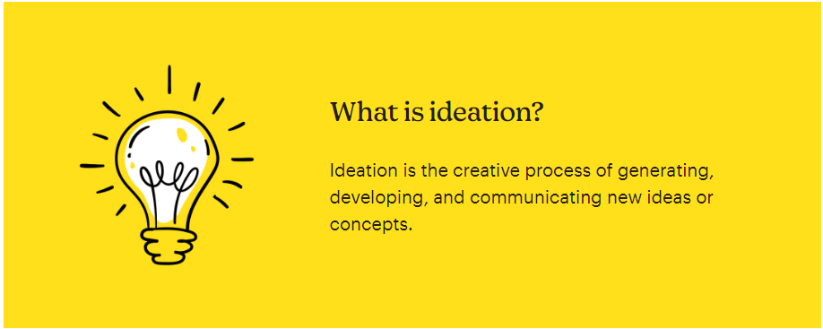

<h1 style="font-size:60px">welcome to module 1!</h1>

Welcome to Module 1! This module will help you generate and refine your business idea through structured techniques and resources.

   

# Part 1: Learn the Basics of Ideation
>**Your first step in developing a great business idea is understanding the core principles.**

Skim through <a style="color:#3498db" href="https://mailchimp.com/resources/ideation-strategy/?ds_c=DEPT_AOC_Google_Search_ROW_EN_NB_Acquire_Broad_DSA-Rsrc-NE_T3&ds_kids=p80322579832&ds_a_lid=dsa-2227026702184&ds_cid=71700000119083209&ds_agid=58700008729598093&gad_source=1&gclid=CjwKCAjw3P-2BhAEEiwA3yPhwKj5WTSuaqCHGWMCdlSDopgdDpgfhlYWfKYBmeWT6U66UM9D4XD-GxoCY4cQAvD_BwE&gclsrc=aw.ds">this article</a> to get an idea of what ideation is, why it’s important in the grand scheme of things and what are some general ways of ideating.

 

 

Okay now that you have a very basic idea of what an idea is, let's go in slightly more depth to learn the ways to think of great business ideas.

---


    
---

If you still feel like its not very clear how generating good business ideas works. <a style="color:#3498db" href="https://www.paulgraham.com/startupideas.html">Read this amazing essay by Paul Graham</a>. This will clear everything out. Long read but definitely worth it.  

Now, it's really important that you can explain what your idea is to someone who knows nothing about it. Thus, you need a simple one-liner that can be the face of your idea. It’s a great skill to be able to condense your idea into one single line. Read the article below to learn how to convert your ideas into a one-liner. There are many examples of established startups to help you understand what an ideal one-liner should look like.

<a style="color:#3498db" href="https://www.boringbusinessnerd.com/post/how-to-describe-your-business-in-1-sentence">How To Describe Your Business In One Line</a>

 

# Part 2: Apply What You've Learned
>**Time to put those ideas to the test! Follow the instructions below to start generating your own business idea.**

## Instructions

1. Brainstorm **at least 3 business ideas** using one of the techniques from the resources above. Be open-minded and **write down every idea**, even the crazy ones!

2. Narrow it down to **one idea** that excites you and has market potential. Think about its feasibility and whether it's aligned with your goals. Choose the one you’re most passionate to explore and feel like ***“Yeah man this is something that needs to be there and I can get it done!!"***

3. Now it's time to convert your idea into a **one-liner**. Use the <a style="color:#3498db" href="https://docs.google.com/presentation/d/1C6__bjT2l1T1FH7GXMIpyO_l__uCLNrsNpCK8x_ioOs/edit?usp=sharing">one-liner template here</a>. **Do not edit directly on the template document**. Create a copy of the template document in your accounts. Choose any slide you prefer (whichever colour speaks to you the most). Edit it with your one-liner. 

4. Download your one-liner as a **JPEG/PNG**. 

 

# Update Submission

<h3> After completing the steps above, submit your update through the <a href="https://forms.gle/h2ayirtiJW9wRReU6" style="color:#F05555;"><b>form here</b></a>. This is a <i>key</i> part of tracking your progress and receiving feedback. </h3>

 

<a style="color:#F05555;; font-size:25px;" href="https://forms.gle/h2ayirtiJW9wRReU6">SUBMIT YOUR UPDATE HERE.</a>

 

Remember! You can always revisit these resources and refine your ideas over time. Take your time to explore, experiment, and push your creative limits!

 