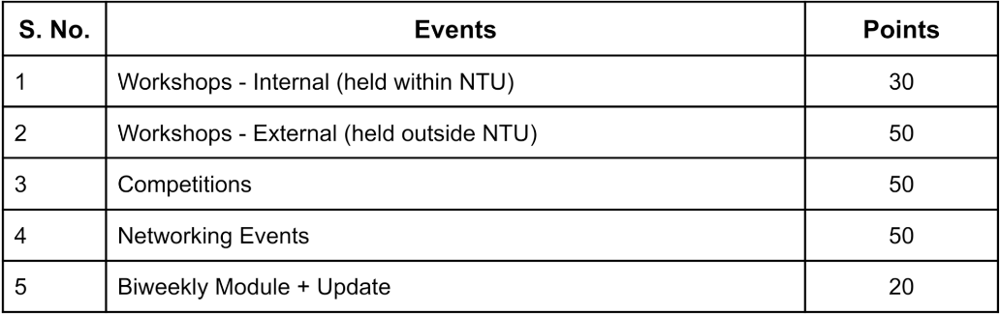
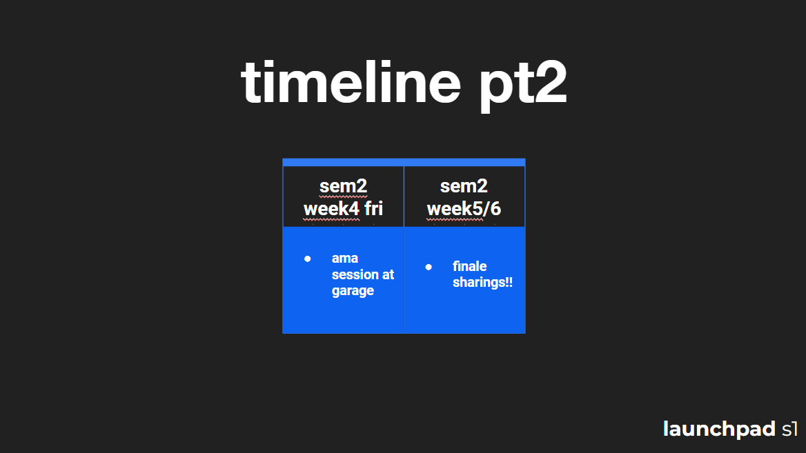

<h1 style="font-size:60px">welcome to week 1.</h1>

we're so glad that you made it. ty for showing up. here's all the info you'll need for this week.

   

## watch recording of lecture #1.

<ins>all lecture recordings are now available in the os.</ins>

you can find them in the recordings folder on the right (highlighted red). you can also submit your weekly updates from the os. it's right below the countdown clock.

we highly recommend you either installing the the os (step 4 **[here](https://github.com)**) for the next 6 weeks. it's where you can get all of the info for the season.

you can also find lecture #1 **[here](https://github.com)**. it's not actually 3 hrs btw lol.
starts at: 29:01
ends at: 01:39:00

## Structure

Biweeky modules -> otot(ish) events

<h1 style="font-size:60px">Module 1: idea 💡</h1>

1. Collection of Resources
2. Learn
3. Update
4. Apply

## Events

## Attendance

Upload 1 picture/event in the update form

Accessable **[HERE](#attendance)**

## Timeline

# Video!!! 💡 



# Insta!!



<h2>don't forget — update #1 is due <s style="color:grey">monday, june 24 @ 11:59 pm pt</s> thursday, june 27 @11:59 pm pt.</h2>

<a style="color:red; font-size:30px" href="">submit update 1.</a>